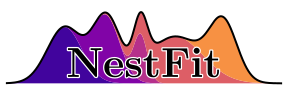

=====================
Bayesian Line Fitting
=====================

Welcome to the NestFit documentation!  NestFit is a Bayesian framework for
model fitting spectral line data containing single or multiple velocity
components. The site index may be found in the sidebar with the
:doc:`installation instructions <install>` and a :doc:`quick-start guide
<quickstart>`.

Help and Contributing
=====================
If you run into an issue, please report it on the `issue tracker
<https://github.com/autocorr/nestfit/issues>`_ and I am happy to assist.  If
you would like general help, please also feel free to contact me at the gmail
address ``brian.e.svoboda+nestfit``.

Contributions are also very welcome.  The package is implemented in a mix of Python
and `Cython <https://cython.org>`_, and is released under the MIT license.  The
latest development version can be found `here <https://github.com/autocorr/nestfit>`__.
Feel free to contact me, open an issue for discussion, or create a pull request.

Citing this project
===================
If you make use of NestFit in an academic work, please cite the forth-coming
publication that will be listed here (Svoboda `in prep.`) as well as the
publications for MultiNest (Feroz & Hobson
`2008 <https://ui.adsabs.harvard.edu/abs/2008MNRAS.384..449F/abstract>`__;
Feroz, Hobson, & Bridges
`2009 <https://ui.adsabs.harvard.edu/abs/2009MNRAS.398.1601F/abstract>`__).
Please also consider citing the relevant publications for the library
dependencies used in this project: astropy, cython, h5py, matplotlib,
numpy/scipy, pyspeckit, and spectral_cube.

License
=======
NestFit is copyrighted by Brian Svoboda (2020) and released under the MIT
license. A copy is supplied in the LICENSE file included with the software.

This software makes use of the ammonia model code found in PySpecKit by
Adam Ginsburg & Jordan Mirocha and contributors. The Python implementation in
PySpecKit was originally based on the IDL program ``nh3fit``
(`source <https://github.com/low-sky/idl-low-sky/tree/master/nh3fit>`__)
by Erik Rosolowsky, described in Rosolowsky et al.
(`2008 <https://ui.adsabs.harvard.edu/abs/2008ApJS..175..509R/abstract>`__).

The implementation of the fast exponential function is taken from the LIME
radiative transfer code developed by Christian Brinch and the LIME development
team. These modified files (``fastexp.h``, ``fastexp.c``) are licensed under
the GNU GPL v3.

Documentation
=============

.. toctree::
   :name: mastertoc
   :maxdepth: 3

   Homepage <self>
   changelog
   Installation <install>
   overview
   quickstart
   Limitations and Issues <limitations>
   store_spec

